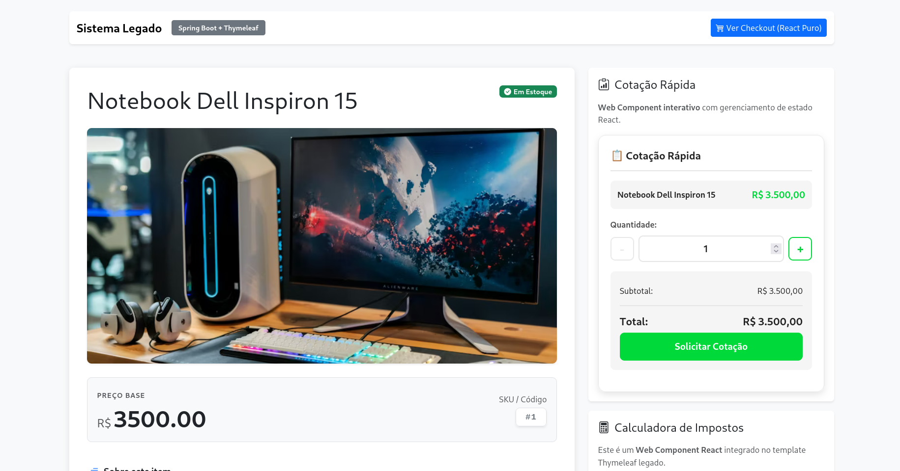

# 🎯 POC: React Web Components em Spring Boot Legacy

## ⚠️ Sobre o ambiente

Para facilitar a execução e evitar problemas de dependências antigas, optei por usar **Java 21 e Spring Boot 3**. 

**"Mas Luan, por que não Java 8 se o foco é legado?"**
1. **Pragmatismo:** Ninguém merece perder tempo configurando JDK antiga ou lidando com repositórios Maven descontinuados. Aqui é `mvn spring-boot:run` e pronto.
2. **Foco na Arquitetura:** O padrão de integração (`r2wc` + Web Components) funciona exatamente da mesma forma em um monolito Java 8 com JSP ou num Spring Boot 3 com Thymeleaf. O "legado" aqui é o modelo mental de SSR acoplado, não a versão da linguagem.

---

## 📖 A Ideia: O "Cavalo de Troia"

O objetivo desta POC é demonstrar como injetar React em um sistema antigo sem a necessidade de um "Big Bang" (reescrever tudo do zero).

A estratégia consiste em:
1. Criar componentes React modernos (TSX, Hooks, etc).
2. Empacotá-los como **Web Components** usando `@r2wc/react-to-web-component`.
3. Injetar no HTML/Thymeleaf como se fosse uma tag nativa (ex: `<tax-widget>`).
4. Quando a página for finalmente migrada para uma SPA, você só remove o wrapper e usa o componente React puro.

## 🏗️ Arquitetura


```text
+------------------------------------------+       +---------------------------------------+
|    MONOLITO (Spring + Thymeleaf)         |       |        APP REACT MODERNA              |
+------------------------------------------+       +---------------------------------------+
|                                          |       |                                       |
| [ <tax-widget value='3500' rate='18'> ]  |       | [ import { TaxCalculator } from... ]  |
|           |                              |       |                |                      |
|           v (Wrapper r2wc)               |       |                v                      |
| [ React Component (TaxCalculator) ]      |       | [ React Component (TaxCalculator) ]   |
|                                          |       |      (✨ Mesma base de código!)       |
+------------------------------------------+       +---------------------------------------+

```

---

## Screenshot da POC



## 🚀 Como Rodar

### Pré-requisitos

* **Java 21+**
* **Maven 3.8+**
* **Node.js 20+** (O Maven gerencia via plugin, mas é bom ter no path).

### O jeito rápido (Build Completo)

```bash
mvn clean package
mvn spring-boot:run

```

O Maven vai baixar o Node, instalar as dependências, buildar o Vite e colocar os assets dentro de `static` automaticamente.

### O jeito dev (Hot Reload)

Se for mexer no código e quiser feedback instantâneo:

1. **Frontend:** `cd frontend && npm install && npm run dev`
2. **Backend:** `mvn spring-boot:run`

---

## 📂 O que tem no projeto?

* **`frontend/src/components/`**: Onde mora o React de verdade. Componentes puros, testáveis e isolados.
* **`entry-legado.tsx`**: Onde a mágica acontece. Aqui definimos os nomes das tags customizadas e mapeamos as props que o HTML vai enviar para o React.
* **`src/main/resources/templates/product.html`**: Um template Thymeleaf clássico (com jQuery e Bootstrap) "invadido" pelo nosso componente React.

---

## ✨ Por que essa abordagem?

| Vantagem | Na prática |
| --- | --- |
| **Investimento Seguro** | Se decidirem abandonar os Web Components, seu código React continua sendo React puro. |
| **Zero Conflito** | O Shadow DOM garante que o CSS do legado não quebre o componente e vice-versa. |
| **Migração Suave** | Você entrega valor em telas antigas hoje, sem esperar meses por uma migração total. |
| **DX (Developer Experience)** | O time de frontend trabalha com ferramentas modernas (Vite, TS), mesmo em um projeto de 10 anos atrás. |

---

## 🛠️ Stack Técnica

* **Backend:** Spring Boot 3.2.2, Thymeleaf, Lombok.
* **Frontend:** React 18.2, TypeScript, Vite.
* **Ponte:** `@r2wc/react-to-web-component`.
* **Automação:** `frontend-maven-plugin` (para o build ser "self-contained").

> **Nota sobre o build:** Usei o `frontend-maven-plugin` para garantir que o projeto seja autocontido. Ao rodar o Maven, ele cuida de todo o pipeline do frontend, facilitando o deploy em esteiras de CI/CD sem precisar configurar o Node manualmente no servidor.

---

[hardened](https://hardened.com.br) | por Luan Rodrigues
